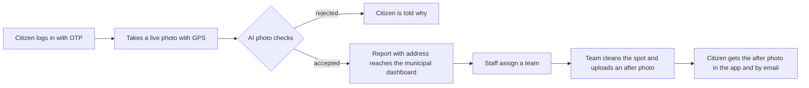

# Clean City

**Report street garbage in seconds. AI verifies the photo, the municipal team cleans the spot, and the reporter gets the proof.**


---

## The problem

In many streets of Bengaluru, garbage is dumped in the open. It piles up for days, spreads disease, and nobody is sure whether it was ever reported. Phone calls and paper complaints give the citizen no proof that anything happened, and give the municipal corporation no exact location to send a team to.

## The solution

Clean City is a web app that works in any phone browser. A citizen takes a live photo of the garbage, the app attaches the exact GPS coordinates and street address, AI models check that the photo is genuine, and the report lands on the municipal dashboard. When the team has cleaned the spot, they upload an after photo, and the citizen receives it in the app and by email.



## Features

### For citizens

- **Passwordless login** with a 6-digit one-time code sent to an email address or mobile number.
- **Live camera capture.** The camera opens inside the page, so old gallery photos cannot be uploaded.
- **Automatic location.** GPS coordinates are captured with the photo and converted to a street address.
- **Clear feedback.** If a photo is rejected, the citizen is told exactly why.
- **Status tracking.** Every report shows Received, Team assigned, Cleaned or Rejected.
- **Proof of work.** The after-cleaning photo appears in the app and is emailed to the reporter.

### For municipal staff

- **One dashboard** with every report: photo, address, coordinates, Google Maps link, reporter and AI scores.
- **Filters** by status with live counts.
- **Assign a team**, **reject a false report with a reason**, or **mark it cleaned** by uploading an after photo.
- **Fake-photo warning.** Reports the AI is unsure about are flagged so staff check before sending a team.
- **Staff are registered in advance** by an admin. Nobody can make themselves staff from inside the app.

## How the photo checks work

Every photo passes through these checks before a report is accepted.

| Check | What it stops | How it works |
|---|---|---|
| Live capture | Old or downloaded photos | The page opens the camera directly; there is no file picker for citizens |
| Location | Reports with no place | Browser geolocation is required; the address comes from OpenStreetMap |
| Quality | Dark or blank photos | Brightness and contrast thresholds |
| Is it garbage? | Selfies, rooms, screenshots, food, documents | CLIP zero-shot classification: 4 garbage descriptions against 11 other descriptions; the garbage share must be at least 0.55 |
| Already reported? | The same pile reported twice | CLIP image similarity of 0.90 or more against open reports within 300 metres, plus a 64-bit perceptual hash for near-identical files |
| AI-generated? | Synthetic images | A SigLIP-based detector: 0.99 or more is rejected, 0.50 to 0.99 is accepted but flagged for staff |
| Spam | Flooding the system | A daily cap on reports per account |
| After photo | Marking a spot cleaned when it is not | The same garbage check runs on the staff photo; staff must confirm if it still looks like garbage |

**Measured during testing.** Repeated photos of the same scene scored 0.92 to 0.97 in similarity, while different garbage photos scored 0.87 or lower, which is why the cut-off is 0.90. Real garbage photos scored 0.99 to 1.00 on the garbage check.

## Tech stack

| Layer | Technology |
|---|---|
| Backend | Python 3.12, FastAPI, Uvicorn |
| Database | SQLite |
| AI models | `openai/clip-vit-base-patch32` (garbage check and similarity), `Ateeqq/ai-vs-human-image-detector` (AI-generated check), running on PyTorch and Hugging Face Transformers |
| Frontend | Plain HTML, CSS and JavaScript, mobile first, no framework |
| Login | Email one-time codes over SMTP, JSON Web Tokens |
| Maps and addresses | OpenStreetMap Nominatim, Google Maps links |

## Project structure

```
clean-city-app/
|-- main.py            Server entry point and page routes
|-- auth.py            One-time codes, login tokens, role checks
|-- complaints.py      Citizen reports: upload, checks, address lookup
|-- staff.py           Municipal dashboard actions and notifications
|-- checks.py          AI photo checks
|-- database.py        Tables and the staff admin commands
|-- requirements.txt   Python libraries
`-- static/
    |-- login.html     Login page
    |-- report.html    Citizen page
    `-- dashboard.html Municipal dashboard
```

## Run it locally

You need Python 3.12 and about 2 GB of free disk space for the AI models.

**Windows (PowerShell)**

```powershell
git clone https://github.com/pandeylakshya207-max/clean-city-app.git
cd clean-city-app
python -m venv venv
.\venv\Scripts\Activate.ps1
pip install -r requirements.txt
uvicorn main:app --reload
```

**macOS or Linux**

```bash
git clone https://github.com/pandeylakshya207-max/clean-city-app.git
cd clean-city-app
python3 -m venv venv
source venv/bin/activate
pip install -r requirements.txt
uvicorn main:app --reload
```

Open http://127.0.0.1:8000 in your browser. The first report downloads the AI models (about 1 GB), so it takes longer than the rest.

### Email setup (optional)

Without any setup the app runs in development mode and prints login codes in the terminal. To send real emails, create a file named `.env` in the project folder:

```
SMTP_USER=your-address@gmail.com
SMTP_PASSWORD=your-16-letter-gmail-app-password
```

Use a Gmail app password, not your normal password. The `.env` file is ignored by Git.

### Managing municipal staff

Staff are registered by an admin from the terminal. A registered person gets the dashboard on their first login.

```
python database.py staff name@example.com     Register an email as staff
python database.py staff 9876543210           Register a mobile number as staff
python database.py staff                      List all staff
python database.py citizen name@example.com   Change an account back to citizen
```

## API overview

| Method | Path | Who | Purpose |
|---|---|---|---|
| POST | `/api/auth/request-otp` | Anyone | Send a login code |
| POST | `/api/auth/verify-otp` | Anyone | Check the code and return a token |
| GET | `/api/me` | Logged in | Current account and role |
| POST | `/api/complaints` | Logged in | Submit a report (photo, latitude, longitude, note) |
| GET | `/api/complaints/mine` | Logged in | The caller's own reports |
| GET | `/api/staff/complaints` | Staff | All reports, with optional status filter |
| POST | `/api/staff/complaints/{id}/assign` | Staff | Assign a team |
| POST | `/api/staff/complaints/{id}/reject` | Staff | Reject with a reason |
| POST | `/api/staff/complaints/{id}/clean` | Staff | Upload the after photo and close the report |

Interactive API documentation is available at `/docs` while the server is running.

## Security and privacy

- Login codes are stored only as keyed hashes, expire after 5 minutes, allow 5 attempts, and are limited to 3 requests per 10 minutes.
- Login tokens are signed and expire after 7 days.
- The role is checked on the server for every staff action.
- Uploaded photos are re-encoded, which removes hidden metadata, and resized.
- Passwords, keys, the database and uploaded photos are excluded from this repository.

## Known limitations

- **The AI-generated detector is not reliable on its own.** In testing, two captures of the same picture scored 0.00 and 0.95. That is why it only rejects at 0.99 and otherwise flags the report for a human.
- **A photo of a screen showing garbage can pass.** The live camera rule and the location requirement reduce this, and staff can reject false reports.
- **Laptop location is approximate.** Phones with GPS are far more accurate.
- **Mobile-number codes are not sent by SMS yet.** They are printed in the server terminal until an SMS provider is connected.
- **Phones need a secure link.** Browsers only allow the camera and GPS over https or on localhost.

## Roadmap

- SMS delivery for mobile-number logins
- Hosted database and photo storage for cloud deployment
- Accept reports only inside the city boundary
- An admin page for managing staff
- A map view of open reports for route planning
- Strikes for accounts that repeatedly send false reports

---

Built by [@pandeylakshya207-max](https://github.com/pandeylakshya207-max)
